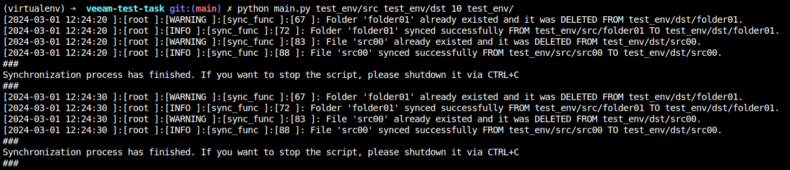
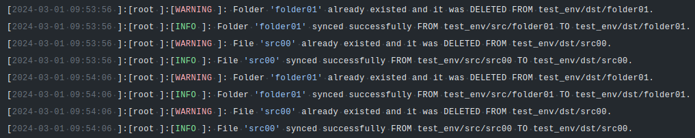

# Veeam's Test Task
<br>

## Objective :pushpin:
Please implement a program that synchronizes two folders: source and replica. The
program should maintain a full, identical copy of source folder at replica folder.

## Requirements :pushpin:
- Synchronization must be one-way: after the synchronization content of the
replica folder should be modified to exactly match content of the source
folder;
- Synchronization should be performed periodically.
- File creation/copying/removal operations should be logged to a file and to the
console output;
- Folder paths, synchronization interval and log file path should be provided
using the command line arguments;
- It is undesirable to use third-party libraries that implement folder
synchronization;
- It is allowed (and recommended) to use external libraries implementing other
well-known algorithms. For example, there is no point in implementing yet
another function that calculates MD5 if you need it for the task – it is
perfectly acceptable to use a third-party (or built-in) library.
<br>

## Usage :pushpin:

### How it works
The script receives 4 arguments: `<SOURCE_FOLDER>` and `<DEST_FOLDER>`, `<SYNC_INTERVAL>` and `<LOGS_PATH>`.

- `<SOURCE_FOLDER>`: The source of the files to be synced.
- `<DEST_FOLDER>`: The destiny folder to where the files should be synced to.
- `<SYNC_INTERVAL>`: The time interval between syncs.
- `<LOGS_PATH>`: The place where the sync logs should be stored.

All arguments are sent to a function called `validate_args()` that validates if the arguments type are correct.

Than the 3 first arguments are passed into a function called `sync_process()` and here is where all of synchronization actions take place.
The `<LOGS_PATH>` argument is used on the `logs` module.

The `sync_process()` function runs an infinite loop that forces the script to keep until you manually stop it. Basically what this function
will be doing is reading every item inside the `<SOURCE_FOLDER>`, checks if it's a file or a folder and copies it into the `<DEST_FOLDER>`.
Inside this function I call 2 other functions `sync_file` and `sync_folder` because the copy of files and folders is handled differently. This action
will be executed with the interval set on the `<SYNC_INTERVAL>`.

#### The output
Console:<br />

<br>

Logs:<br />

<br>

### Requirements
- Python3

### How To
In order to execute the script, just type the following command: <br />
```bash
python main.py <SOURCE_FOLDER> <DEST_FOLDER> <SYNC_INTERVAL> <LOGS_PATH>
```
<br>

:information_source: `<SYNC_INTERVAL>`: should be set in SECONDS.
